回顾：

1、ES6--为Vue服务

2、Vue的基础语法 -- 渐进式

- {{插值表达式}}
- 指令（v-text、v-html、v-on（事件）、v-for、v-if、v-bind、v-show）
- 生命周期钩子函数
- 计算属性：本质是方法，但是可以像属性一样使用

3、综合练习-sms系统    ------- 像jQuery一样使用Vue


4、像node一样使用Vue---企业级的Vue开发方式


# 1.组件化

组件：意思？


在大型应用开发的时候，页面可以划分成很多部分。往往不同的页面，也会有相同的部分。例如可能会有相同的头部导航、尾部信息模块。

但是如果每个页面都独自开发，这无疑增加了我们开发的成本。所以我们会把页面的不同部分拆分成独立的组件，然后在不同页面就可以共享这些组件，避免重复开发。


## 1.1.定义全局组件

我们可以使用 Vue.component 来定义一个组件：

```js
Vue.component(组件名称, Vue对象)
```

在 Vue 对象中我们需要使用 template 来定义组件的 HTML 部分。

（提示：在 ES6 中我们可以使用 模板字符串` 符号来定义多行字符串）

示例：

```js
Vue.component('hello', {
    template: `<p>Hello World !</p>`
})
```

注意：template 中的 HTML 代码必须要写在一个根元素中。

什么是根元素呢？看下图：

根元素：最外层要有一个标签。

 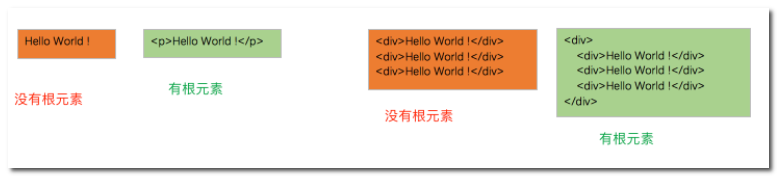

- 案例：

 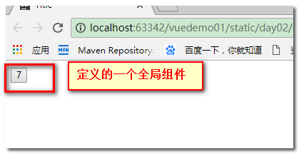

- 案例实现-最简单的实现

  ```html
  <div id="app">
  
      <!-- 使用模板 -->
      <counter></counter>
  </div>
  <script>
  // 在此处定义全局组件--自定义组件
  // 两个参数：
  // 第一个参数：组件名
  // 第二个参数：组件内容
  Vue.component("counter",{
      // 将HTML代码写在这里
      // 这个里面的HTML代码必须只能有一个根元素
      template:`<button>加</button>`// 使用模板字符串 定义
  
  })
  ```

- 进阶一：可以相加

  ```
  <!DOCTYPE html>
  <html lang="en">
  <head>
      <meta charset="UTF-8">
      <title>Title</title>
      <script src="../vue-2.6.10.js"></script>
  </head>
  <body>
  
  <div id="app">
  
      <!-- 使用模板 -->
      <counter></counter>
  </div>
  <script>
  // 在此处定义全局组件--自定义组件
  // 两个参数：
  // 第一个参数：组件名
  // 第二个参数：组件内容
  Vue.component("counter",{
      // 将HTML代码写在这里
      // 这个里面的HTML代码必须只能有一个根元素
      template:`<button @click="num++">加{{num}}</button>`,// 使用模板字符串 定义
      // data:{
      //     num:0
      // }
      //1 此处是有data，但是data必须定义为方法
      //2 方法必须要有返回值
      data(){
          return {
              num:0
          }
      }
  
  
  })
  
  
  
  
  var vm = new Vue({
     el:"#app"
  
  
  });
  
  </script>
  </body>
  </html>
  ```

- 进阶二：组件中调用方法

```html
<!DOCTYPE html>
<html lang="en">
<head>
    <meta charset="UTF-8">
    <title>Title</title>
    <script src="../vue-2.6.10.js"></script>
</head>
<body>
<div id="app">
    <!-- 使用模板 -->
    <counter></counter>
</div>
<script>
// 在此处定义全局组件--自定义组件
// 两个参数：
// 第一个参数：组件名
// 第二个参数：组件内容
Vue.component("counter",{
    // 将HTML代码写在这里
    // 这个里面的HTML代码必须只能有一个根元素
    template:`<button @click="add()">加{{num}}</button>`,// 使用模板字符串 定义
    // data:{
    //     num:0
    // }
    //1 此处是有data，但是data必须定义为方法
    //2 方法必须要有返回值
    data(){
        return {
            num:0
        }
    },
    methods:{
        add(){
            this.num++
        }
    }
})
var vm = new Vue({
   el:"#app"
});
</script>
</body>
</html>
```


```html
<script src="../vue-2.6.10.js"></script>
<div id="app">
    <counter></counter>
</div>
<script>
// 定义全局组件，两个参数，组件名称和组件参数
Vue.component("counter",{
    template:`<button v-on:click="count++" >{{count}}</button>`,
    data(){
        return {
            count:0
        }
    }

})

var vm = new Vue({
   el:"#app",
});
</script>
```

结论：

- 组件其实也是一个Vue实例，因此它在定义时也会接收：data、methods、生命周期函数、计算属性等
- 不同的是组件不会与页面的元素绑定，否则就无法复用了，因此没有el属性。
- 但是组件渲染需要html模板，所以增加了template属性，值就是HTML模板
- 全局组件定义完毕，任何vue实例都可以直接在HTML中通过组件名称来使用组件了。
- data的定义方式比较特殊，必须是一个函数，且必须有返回值
- 全局组件必须有一个根元素


## 1.2.组件的复用

定义好的组件，可以任意复用多次：

```html
<div id="app">
    <!--使用定义好的全局组件-->
    <counter></counter>
    <counter></counter>
    <counter></counter>
</div>
```

效果：

 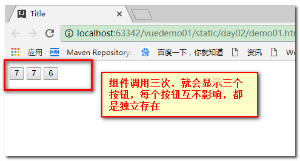

你会发现每个组件互不干扰，都有自己的count值。怎么实现的？

> **组件的data属性必须是函数**！

当我们定义这个 `<counter>` 组件时，它的data 并不是像这样直接提供一个对象：

```js
data: {
  count: 0
}

```

取而代之的是，一个组件的 data 选项必须是一个函数，因此每个实例可以维护一份被返回对象的独立的拷贝：

```js
data: function () {
  return {
    count: 0
  }
}
```

如果 Vue 没有这条规则，点击一个按钮就会影响到其它所有实例！


课堂代码：

```js
<script src="../vue-2.6.10.js"></script>
<div id="app">
    <!-- 组件肯定使用在页面中
         组件的使用方式:以组件名为标签访问
     -->
    <counter></counter><br>
    <counter></counter><br>
    <list></list><br>
    <list></list><br>
</div>
<script>
// 全局组件挂载到Vue对象中
// 第一个参数：组件名字
// 第二个参数：组件内容，需要是一个对象
Vue.component("counter",{
    // 在组件中也必须要有模板，模板要写在一个根元素中，在vue中，只能有一个最大的父元素绑定el
    // 模板内容需要使用 模板字符串
    template:`<button @click="num++">加{{num}}</button>`,
    // 模板中，data只能定义成方法格式，不能定义属性
    // data方法必须要有返回值
    data(){
        return {
            num:0
        }
    },
    methods:{

    }
});

// 继续写
Vue.component("list",{
    template:`<ul>
                <li v-for="user in users">{{user.name}} - {{user.age}}</li>
            </ul>`,
    data(){
        return {
            users:[{name:"lucy",age:12},
                {name:"tom",age:12},
                {name:"lily",age:12}
            ]
        }
    }
})


var vm = new Vue({
  el:"#app"
})
</script>
```


## 1.2.局部组件-注册

一旦全局注册，就意味着即便以后你不再使用这个组件，它依然会随着Vue的加载而加载。

因此，对于一些并不频繁使用的组件，我们会采用局部注册。

我们先在外部定义一个对象，结构与创建组件时传递的第二个参数一致：

```js
const counter = {
    template:'<button v-on:click="count++">点击 {{ count }} </button>',
    data(){
        return {
            count:0
        }
    }
};
```

然后在Vue中使用它--注册局部组件：

```js
var app = new Vue({
    el:"#app",
    components:{
        // counter:counter // 将定义的对象注册为组件
    	counter
    }
})
```

- components就是当前vue对象子组件集合。
  - 其key就是子组件名称
  - 其值就是组件对象的属性
- 效果与刚才的全局注册是类似的，不同的是，这个counter组件只能在当前的Vue实例中使用

## 1.3.组件通信

通常一个页面会以一棵嵌套的组件树的形式来组织：

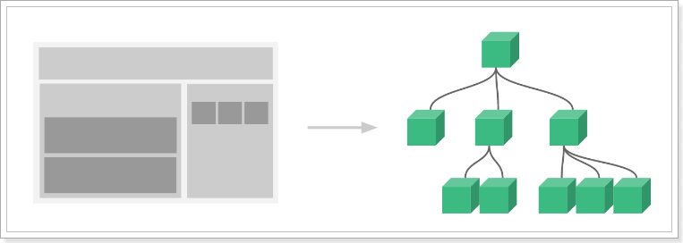

- 页面首先分成了顶部导航、左侧内容区、右侧边栏三部分
- 左侧内容区又分为上下两个组件
- 右侧边栏中又包含了3个子组件

各个组件之间以嵌套的关系组合在一起，那么这个时候不可避免的会有组件间通信的需求。

### 1.3.1.父向子传递props

比如我们有一个子组件：

```js
Vue.component("introduce",{
    // 直接使用props接收到的属性来渲染页面
    template:'<h3>{{title}}</h3>',
    props:['title'] // 通过props来接收一个父组件传递的属性
})
```

- 这个子组件中要使用title属性渲染页面，但是自己并没有title属性
- 通过props来接收父组件属性，名为title

父组件使用子组件，同时传递title属性：

```html
<script src="../vue-2.6.10.js"></script>
<div id="app">
    <h1>打个招呼：</h1>
    <!--使用子组件，同时传递title属性-->
    <introduce title="大家好，我是奇哥"/>
</div>

<script type="text/javascript">
    Vue.component("introduce",{
        // 直接使用props接收到的属性来渲染页面
        template:'<h1>{{title}}</h1>',
        props:['title'] // 通过props来接收一个父组件传递的属性
    })
    var app = new Vue({
        el:"#app"
    })
</script>
```

效果：

   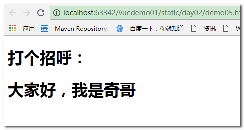


课堂代码：

```
<!DOCTYPE html>
<html lang="en">
<head>
    <meta charset="UTF-8">
    <title>父向子传值</title>
    <script src="../vue-2.6.10.js"></script>
</head>
<body>
<div id="app">
<input type="text" v-model="myname"><br>
<introduce :name="myname"></introduce>

</div>

<script>
Vue.component("introduce",{
    template:`<h2>大家好，我来自传智大学,我的名字叫{{name}}</h2>`,
    props:['name']//引号中名字就是变量，这种定义，就表示从父组件获取值，调用组件的时候，以属性的方式将值传递进来
});


var vm = new Vue({
    el:"#app",
    data:{
        myname:""
    }
});

</script>


</body>
</html>
```


### 1.3.2.父向子-传递复杂数据

我们定义一个子组件：

```js
const myList = {
    template:`
        <ul>
        	<li v-for="item in items" :key="item.id">{{item.id}} : {{item.name}}</li>
        </ul>
        `,
    props:['items']
}
```

案例：

```html
<script src="../vue-2.6.10.js"></script>
<div id="app">
<list :items="items"></list>

</div>
<script>
Vue.component("list",{
    template:`<ul>
                <li v-for="item in items">{{item.username}} - {{item.age}}</li>
            </ul>`,
    props:['items']
})
var vm = new Vue({
    el:"#app",
    data:{
        items:[{"username":"lucy",age:18},
            {"username":"tom",age:20},
            {"username":"jack",age:18},
            {"username":"lily",age:21}
        ]
    }
})

</script>
```


效果：

   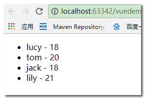


课堂代码：

```js
<!DOCTYPE html>
<html lang="en">
<head>
    <meta charset="UTF-8">
    <title>父向子传值</title>
    <script src="../vue-2.6.10.js"></script>
</head>
<body>

<div id="app">

    <mylist :lessions="lessions"></mylist>
</div>
<script>

Vue.component("mylist",{
    template:`<ul>
                <li v-for="lession in lessions">{{lession.id}} - {{lession.name}}</li>
            </ul>`,
    props:['lessions']

})


var vm = new Vue({
   el:"#app",
    data:{
       lessions:[{id:1,name:"java"},
           {id:2,name:"mysql"},
           {id:3,name:"servlet"},
           {id:4,name:"mybatis"}
       ]
    }

});

</script>


</body>
</html>
```


### 1.3.3 父向子传值流程解析

 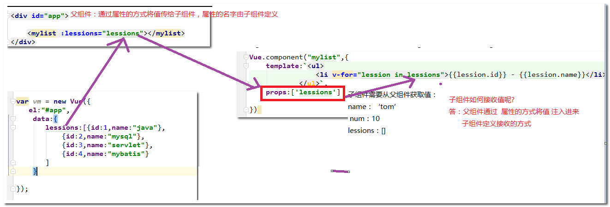

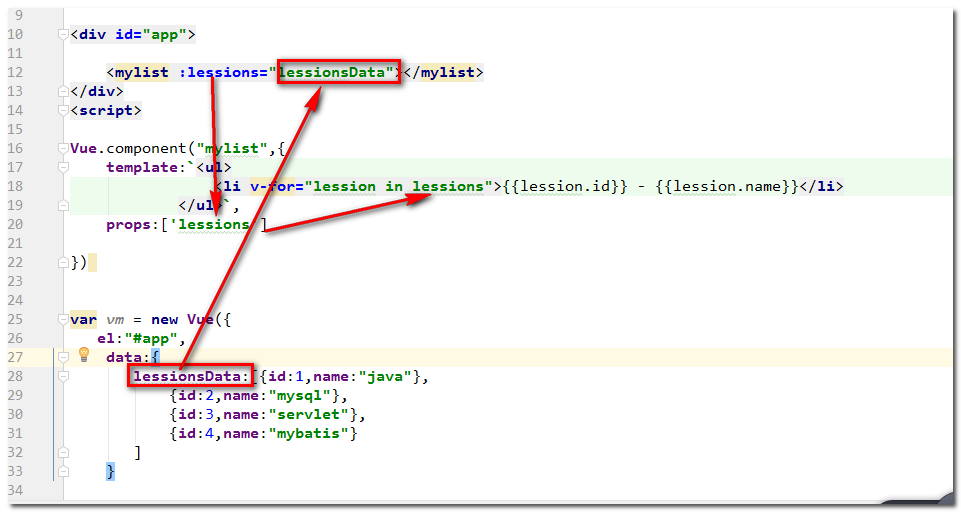

### 1.3.4 父向子传多值

```
<div id="app">

    <mylist :lessions="lessionsData" :title="myname"></mylist>
</div>
<script>

Vue.component("mylist",{
    template:`
            <div>
                <ul>
                    <li v-for="lession in lessions">{{lession.id}} - {{lession.name}}</li>
                </ul>
                大家好，我来自中国，我叫{{title}}
            </div>`,
    props:['lessions','title']

})


var vm = new Vue({
   el:"#app",
    data:{
       lessionsData:[{id:1,name:"java"},
           {id:2,name:"mysql"},
           {id:3,name:"servlet"},
           {id:4,name:"mybatis"}
       ],
       myname:"tom"
    }

});

</script>
```


### 1.3.5.子向父的通信--调用父的无参方法

- 结论：子组件是无法直接改变父组件的数据的，只能通过父组件改变他自己的数据  
-    在子组件中调用父组件的方法，去改变父组件的值


来看这样的一个案例：

```html
<div id="app">
    <h2>num: {{num}}</h2>
    <!--使用子组件的时候，传递num到子组件中-->
    <counter :num="num"></counter>
</div>
<script src="../vue-2.6.10.js"></script>
<script type="text/javascript">
    Vue.component("counter", {// 子组件，定义了两个按钮，点击数字num会加或减
        template:`
            <div>
                <button @click="num++">加</button>  
                <button @click="num--">减</button>  
            </div>`,
        props:['num']// count是从父组件获取的。
    })
    var app = new Vue({
        el:"#app",
        data:{
            num:0
        }
    })
</script>
```

- 子组件接收父组件的num属性
- 子组件定义点击按钮，点击后对num进行加或减操作

我们尝试运行：

 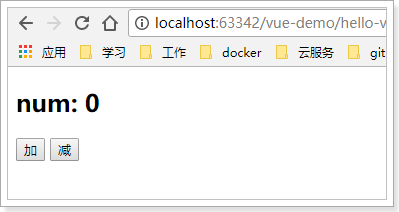

好像没问题，点击按钮试试：

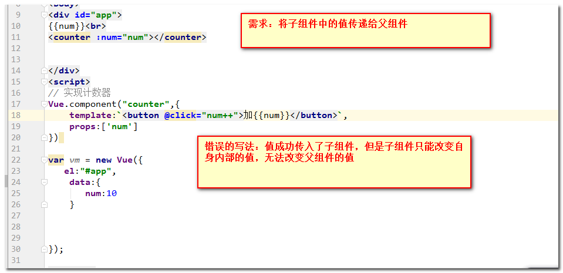

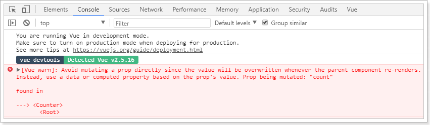

子组件接收到父组件属性后，默认是不允许修改的。怎么办？

既然只有父组件能修改，那么加和减的操作一定是放在父组件：

```js
var app = new Vue({
    el:"#app",
    data:{
        num:0
    },
    methods:{ // 父组件中定义操作num的方法
        increment(){
            this.num++;
        },
        decrement(){
            this.num--;
        }
    }
})
```


但是，点击按钮是在子组件中，那就是说需要子组件来调用父组件的函数，怎么做？

我们可以**通过v-on指令将父组件的函数绑定到子组件**上：

```html
<div id="app">
    <h2>num: {{num}}</h2>
    <counter :count="num" @inc="increment" @dec="decrement"></counter>
</div>
```

然后，当子组件中按钮被点击时，调用绑定的函数：

```js
Vue.component("counter", {
    template:`
<div>
<button @click="plus">加</button>
<button @click="reduce">减</button>  
</div>`,
    props:['count'],
    methods:{
        plus(){
            this.$emit("inc");
        },
        reduce(){
            this.$emit("dec");
        }
    }
})
```

- vue提供了一个内置的this.$emit函数，用来调用父组件绑定的函数

效果：子组件抛的下述错误忽略

 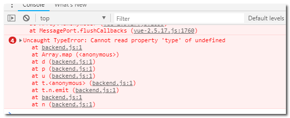

- 流程分析

   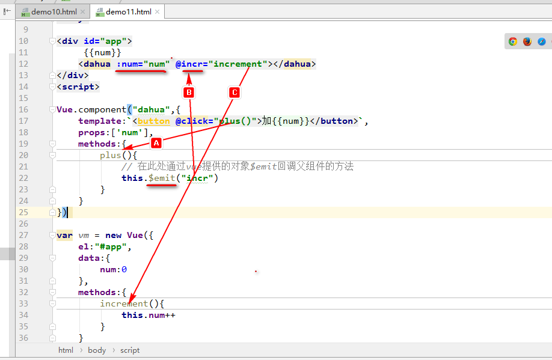


### 1.3.6 子向父通信-调用父的有参方法

		```vue
		<!DOCTYPE html>
		<html lang="en">
		<head>
		    <meta charset="UTF-8">
		    <title>Title</title>
		    <script src="../vue-2.6.10.js"></script>
		</head>
		<body>
		<div id="app">
		    outNum:{{outNum}}<br>
		
		    <counter @outshow="mainshow"></counter>
		</div>
		<script>
		Vue.component("counter",{
		    template:`<button @click="show(10)">show</button>`,
		    methods:{
		        show(num){
		            this.$emit("outshow",num)
		        }
		    }
		})
		
		
		var vm = new Vue({
		    el:"#app",
		    data:{
		        outNum:''
		    },
		    methods:{
		        mainshow(myoutnum){
		            this.outNum = myoutnum
		        }
		    }
		
		});
		</script>
		
		</body>
		</html>
		```


